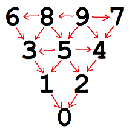

# BowlingSim
Brandon Lee • ORF401S2021

## Files included
* `onegame.py` - Executable. Simulates one game of bowling, prints out the results of each frame, prints the scorecard, and prints the final score.
* `analysis.ipynb` - Executable. A Jupyter notebook detailing further analysis of the bowling simulation
* `engine.py` - Holds most of the mechanisms for the bowling simulation

## Requirements
None for `engine.py` and `onegame.py`; for `analysis.ipynb`, we use:
* `statistics`
* `matplotlib`
* `numpy`
* `scipy`

## Explanation of how pins are knocked down

In the graph above, an arrow A->B indicates that A is "dependent" on B. The default probability that a pin falls in a given roll is defined by the simulation's `SKILL` constant, which has a default value of 0.8. However, this probability is reduced by a factor of 3 for every standing pin that the pin is dependent on.

Whether each pin is standing is evaluated in the order 1, 2, 3, ... as described in the image above so that each pin is evaluated only when the pins it's dependent on have been evaluated. You may notice, however, that this has a flaw: pins 8 and 9 should be dependent on each other for symmetry, but 8 is not dependent on 9 in our graph.